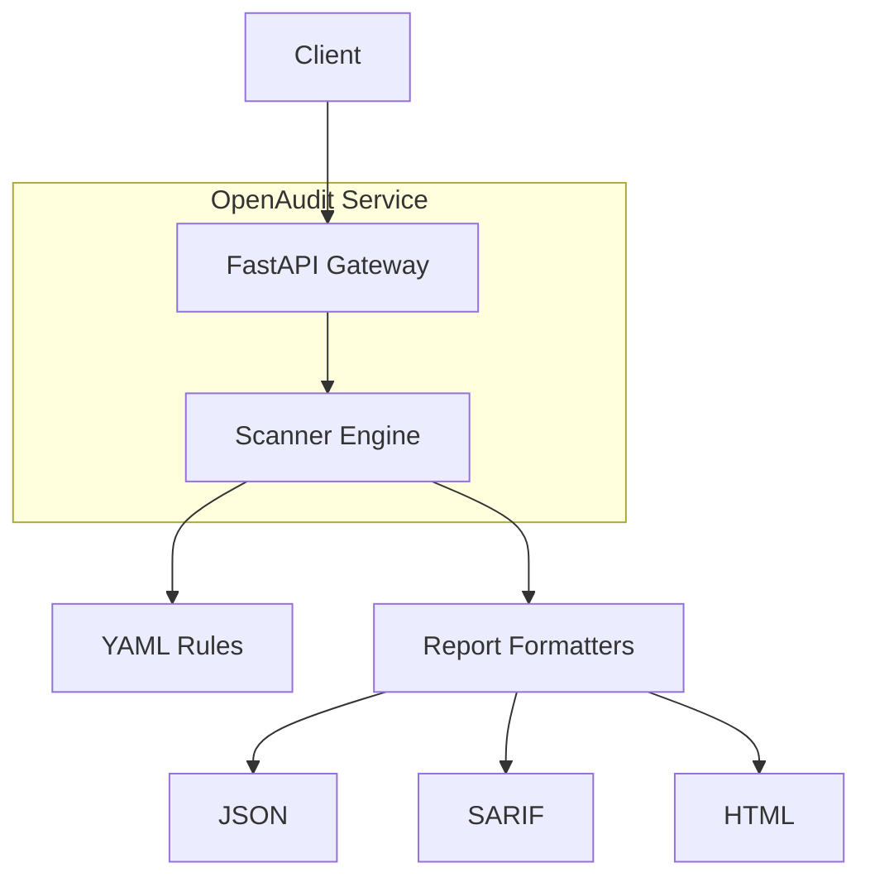

# OpenAudit — Production Guide

Security & bias auditor for AI agents. Deploy as a service to scan agent configurations.

## Architecture



Components:
- **Gateway** (`gateway.py`) — HTTP API: `/scan`, `/health`, `/metrics`, `/rules`
- **Scanner** (`scanner.py`) — rule engine against agent configs
- **Report** (`report.py`) — JSON, SARIF, HTML outputs

---

## Quick Start

```bash
# Clone and install
git clone https://github.com/GBOYEE/open-audit.git
cd open-audit
python -m venv .venv && source .venv/bin/activate
pip install -r requirements.txt
pip install -e .

# Run locally
python gateway.py
# Open http://localhost:8000/docs
```

---

## API

| Method | Endpoint | Description |
|--------|----------|-------------|
| `GET` | `/health` | Health check |
| `GET` | `/metrics` | Request counters (`requests_total`, `requests_failed`, `scans_performed`) |
| `POST` | `/scan` | Upload agent config (multipart/form-data) |
| `GET` | `/rules` | List loaded rules |

**Scan request:**
- Field `agent`: file upload (YAML)
- Field `format`: `json` (default), `sarif`, or `html`

**Responses:**
- `json`: `{ "agent": "name.yaml", "findings": [...] }`
- `sarif`: `application/sarif+json`
- `html`: `text/html`

---

## Docker Compose

```bash
docker-compose up -d
# API on http://localhost:8000
```

---

## Environment Variables

| Variable | Default | Description |
|----------|---------|-------------|
| `OPENAUDIT_ENV` | `production` | `development` enables reload |
| `OPENAUDIT_PORT` | `8000` | Server port |
| `OPENAUDIT_RULES` | `src/openaudit/data/rules.yaml` | Path to rules YAML |

---

## Adding Custom Rules

Create `custom-rules.yaml`:

```yaml
rules:
  - rule_id: my_rule
    description: "My custom check"
    severity: high
    pattern:
      field: "tools"
      contains: "shell"
    suggestion: "Remove shell tool or require approval"
```

Run: `OPENAUDIT_RULES=custom-rules.yaml python gateway.py`

---

## Observability

- Health: `/health` returns status, version, environment.
- Metrics: `/metrics` returns counters.
- Logging: Structured logs to stdout (INFO level).

---

## Testing

```bash
pytest tests/ -v
mypy . --ignore-missing-imports
black --check .
flake8 .
```

---

## Security Considerations

- Input YAML is parsed but not executed. However avoid running scanner with elevated privileges.
- Rate limiting not yet implemented; consider adding nginx or API gateway front-end for public deployments.
- SARIF output can be uploaded to GitHub Advanced Security for PR annotations (future integration).

---

## Roadmap

- Rule engine to support full JSONPath and regex
- Red‑team attack simulation
- Bias detection module
- GitHub Action integration
- Authentication for API

---

MIT License — see `LICENSE`.
